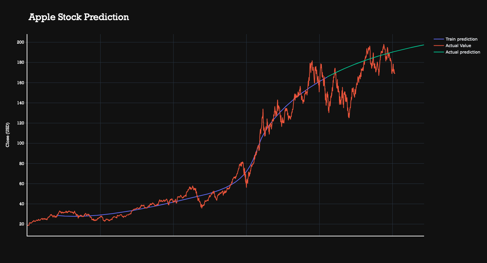
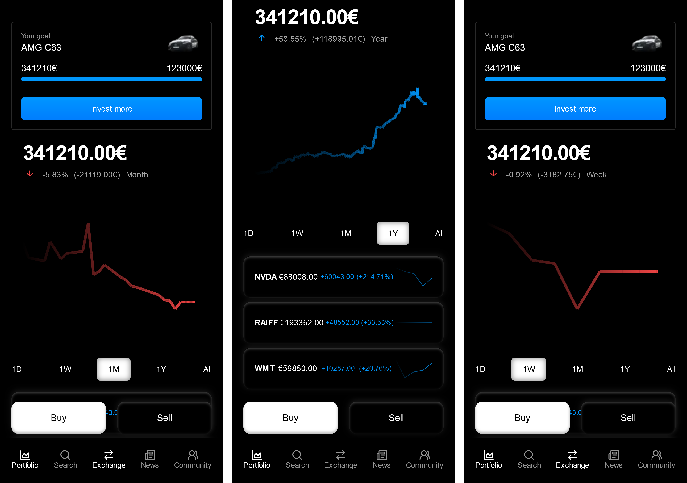

<!-- 
This repository is to show the cool project you created.
To make it easier to present, we created this sample, which you can edit and use for your HK project.
-->

  

&nbsp;

<!--
In the next part, we recommend displaying all important shields for your project: https://github.com/badges/shields
-->

  

Hi, Welcome to TatrInvest!
We are glad you decided to us to be your guides troughout your investing journey! Let us show you what we can help you with.

TatrInvest allows you to easily buy and sell stocks from all over the world with just a few clicks. If you are unsure of what to buy DONT WORRY! we have you covered. Tatran is our AI financial advisor. Tatran is using cutting edge machine learning combined and society behavorial analisis combined with your instrests to create a financial strategy that will make you enjoy managing your finances. He listens to feedback from you and changes his strategies acording to your wishes!

Investing should be a part of everyday life, so it should also be enjoyable, right? We are enriching your investing experience using goals, rewards, leaderbords and dofferent chalanges that are not only fun ,but are making you a better investor! We are sure you are already eager to explore TatrInvest yourself so we will leave the rest of its features for you to explore!

## Contributors ✨
 - Robert Hudák
 - Tomáš Hutňan
 - Dávid Kepič
 - Adrián Mikolaj

## License

<!-- You can use this section to specify the license for this project under which it can be distributed. -->

## Thanks

<!-- You can use this section to thank people who helped you create this awesome project outside of your team -->

